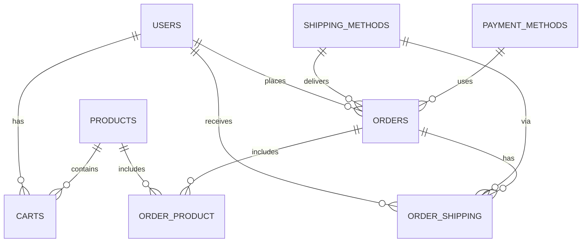

# 📦 Database Design Document – ระบบจัดการร้านค้า

## 🗺️ Entity Relationship Diagram (ER Diagram)

---

## 📑 ตาราง users – เก็บข้อมูลผู้ใช้งานระบบ

| ชื่อฟิลด์ | ประเภทข้อมูล | ต้องมีข้อมูล | Primary Key | Foreign Key | คำอธิบาย |
|-----------|---------------|----------------|----------------|----------------|-------------|
| id | BIGINT | ✔️ | ✔️ | - | รหัสประจำตัวผู้ใช้งาน |
| first_name | varchar(255) | ❌ | ❌ | - | ชื่อของผู้ใช้งาน |
| last_name | varchar(255) | ❌ | ❌ | - | นามสกุลของผู้ใช้งาน |
| created | timestamp | ❌ | ❌ | - | วันที่สร้างข้อมูล |
| updated | timestamp | ❌ | ❌ | - | วันที่แก้ไขล่าสุด |

## 📑 ตาราง products – รายละเอียดสินค้าในระบบ

| ชื่อฟิลด์ | ประเภทข้อมูล | ต้องมีข้อมูล | Primary Key | Foreign Key | คำอธิบาย |
|-----------|---------------|----------------|----------------|----------------|-------------|
| id | BIGINT | ✔️ | ✔️ | - | รหัสประจำสินค้า |
| product_name | varchar(255) | ❌ | ❌ | - | ชื่อสินค้า |
| product_brand | varchar(255) | ❌ | ❌ | - | ยี่ห้อสินค้า |
| stock | int | ❌ | ❌ | - | จำนวนสินค้าคงคลัง |
| product_price | double | ❌ | ❌ | - | ราคาสินค้า |
| image_url | varchar(255) | ❌ | ❌ | - | URL รูปภาพสินค้า |
| created | timestamp | ❌ | ❌ | - | วันที่เพิ่มสินค้า |
| updated | timestamp | ❌ | ❌ | - | วันที่อัปเดตข้อมูลสินค้า |

## 📑 ตาราง shipping_methods – วิธีการจัดส่ง

| ชื่อฟิลด์ | ประเภทข้อมูล | ต้องมีข้อมูล | Primary Key | Foreign Key | คำอธิบาย |
|-----------|---------------|----------------|----------------|----------------|-------------|
| id | BIGINT | ✔️ | ✔️ | - | รหัสวิธีการจัดส่ง |
| name | varchar(255) | ❌ | ❌ | - | ชื่อวิธีการจัดส่ง |
| description | varchar(255) | ❌ | ❌ | - | รายละเอียดเพิ่มเติม |
| fee | double | ❌ | ❌ | - | ค่าธรรมเนียมในการจัดส่ง |
| created | timestamp | ❌ | ❌ | - | วันที่สร้างข้อมูล |
| updated | timestamp | ❌ | ❌ | - | วันที่อัปเดตข้อมูล |

## 📑 ตาราง payment_methods – ช่องทางการชำระเงิน

| ชื่อฟิลด์ | ประเภทข้อมูล | ต้องมีข้อมูล | Primary Key | Foreign Key | คำอธิบาย |
|-----------|---------------|----------------|----------------|----------------|-------------|
| id | BIGINT | ✔️ | ✔️ | - | รหัสวิธีการชำระเงิน |
| name | varchar(255) | ❌ | ❌ | - | ชื่อช่องทางชำระเงิน |
| description | varchar(255) | ❌ | ❌ | - | รายละเอียดช่องทางการชำระเงิน |
| created | timestamp | ❌ | ❌ | - | วันที่สร้างข้อมูล |
| updated | timestamp | ❌ | ❌ | - | วันที่อัปเดตข้อมูล |

## 📑 ตาราง carts – ตะกร้าสินค้าของผู้ใช้งาน

| ชื่อฟิลด์ | ประเภทข้อมูล | ต้องมีข้อมูล | Primary Key | Foreign Key | คำอธิบาย |
|-----------|---------------|----------------|----------------|----------------|-------------|
| id | BIGINT | ✔️ | ✔️ | - | รหัสตะกร้าสินค้า |
| user_id | BIGINT | ✔️ | ❌ | users | รหัสผู้ใช้งาน |
| product_id | BIGINT | ✔️ | ❌ | products | รหัสสินค้า |
| quantity | int | ❌ | ❌ | - | จำนวนสินค้าในตะกร้า |
| created | timestamp | ❌ | ❌ | - | วันที่สร้างรายการ |
| updated | timestamp | ❌ | ❌ | - | วันที่อัปเดตรายการ |

## 📑 ตาราง orders – คำสั่งซื้อจากผู้ใช้งาน

| ชื่อฟิลด์ | ประเภทข้อมูล | ต้องมีข้อมูล | Primary Key | Foreign Key | คำอธิบาย |
|-----------|---------------|----------------|----------------|----------------|-------------|
| id | BIGINT | ✔️ | ✔️ | - | รหัสคำสั่งซื้อ |
| user_id | BIGINT | ✔️ | ❌ | users | ผู้ทำคำสั่งซื้อ |
| shipping_method_id | BIGINT | ✔️ | ❌ | shipping_methods | วิธีการจัดส่ง |
| payment_method_id | BIGINT | ✔️ | ❌ | payment_methods | วิธีการชำระเงิน |
| sub_total_price | double | ❌ | ❌ | - | ราคารวมก่อนลด |
| discount_price | double | ❌ | ❌ | - | จำนวนส่วนลด |
| total_price | double | ❌ | ❌ | - | ราคารวมสุทธิ |
| burn_point | int | ❌ | ❌ | - | คะแนนที่ใช้ |
| earn_point | int | ❌ | ❌ | - | คะแนนที่ได้รับ |
| shipping_fee | double | ❌ | ❌ | - | ค่าขนส่ง |
| transaction_id | varchar(255) | ❌ | ❌ | - | รหัสธุรกรรม |
| status | ENUM | ❌ | ❌ | - | สถานะคำสั่งซื้อ |
| authorized | timestamp | ❌ | ❌ | - | เวลาที่อนุมัติ |
| created | timestamp | ❌ | ❌ | - | วันที่สั่งซื้อ |
| updated | timestamp | ❌ | ❌ | - | วันที่อัปเดต |

## 📑 ตาราง order_product – รายการสินค้าที่อยู่ในคำสั่งซื้อ

| ชื่อฟิลด์ | ประเภทข้อมูล | ต้องมีข้อมูล | Primary Key | Foreign Key | คำอธิบาย |
|-----------|---------------|----------------|----------------|----------------|-------------|
| order_id | BIGINT | ✔️ | ❌ | orders | รหัสคำสั่งซื้อ |
| product_id | BIGINT | ✔️ | ❌ | products | รหัสสินค้า |
| quantity | int | ❌ | ❌ | - | จำนวนสินค้าที่สั่ง |
| product_price | double | ❌ | ❌ | - | ราคาสินค้า ณ เวลาสั่งซื้อ |

## 📑 ตาราง order_shipping – รายละเอียดการจัดส่งของคำสั่งซื้อ

| ชื่อฟิลด์ | ประเภทข้อมูล | ต้องมีข้อมูล | Primary Key | Foreign Key | คำอธิบาย |
|-----------|---------------|----------------|----------------|----------------|-------------|
| id | int | ✔️ | ✔️ | - | รหัสข้อมูลการจัดส่ง |
| order_id | BIGINT | ✔️ | ❌ | orders | คำสั่งซื้อที่เกี่ยวข้อง |
| user_id | BIGINT | ✔️ | ❌ | users | เจ้าของคำสั่งซื้อ |
| method_id | BIGINT | ✔️ | ❌ | shipping_methods | วิธีการจัดส่ง |
| address | varchar(255) | ❌ | ❌ | - | ที่อยู่ผู้รับ |
| sub_district | varchar(255) | ❌ | ❌ | - | ตำบล |
| district | varchar(255) | ❌ | ❌ | - | อำเภอ |
| province | varchar(255) | ❌ | ❌ | - | จังหวัด |
| zip_code | varchar(5) | ❌ | ❌ | - | รหัสไปรษณีย์ |
| recipient_first_name | varchar(255) | ❌ | ❌ | - | ชื่อผู้รับ |
| recipient_last_name | varchar(255) | ❌ | ❌ | - | นามสกุลผู้รับ |
| phone_number | varchar(13) | ❌ | ❌ | - | เบอร์ติดต่อผู้รับ |
| created | timestamp | ❌ | ❌ | - | วันที่สร้างข้อมูลจัดส่ง |
| updated | timestamp | ❌ | ❌ | - | วันที่อัปเดตข้อมูล |
